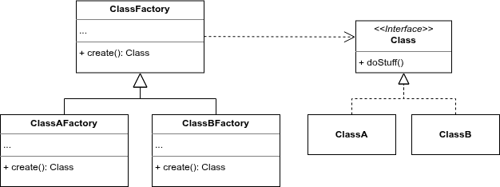

# design-patterns
Repository to store design patterns examples implemented using Java
- [Creational Patterns](#creational-patterns)
  - [Factory Method](#factory-method)
- [Structural Patterns](#structural-patterns)
- [Behavioral Patterns](#behavioral-patterns)
- [References](#references)

## Creational Patterns

### Factory Method

**Structure**

**Implementation**

[./src/main/java/br/com/eventhorizon/pattern/creational/factory/method](./src/main/java/br/com/eventhorizon/pattern/creational/factory/method)

## Structural Patterns

TODO

## Behavioral Patterns

TODO

## References

- [Refactoring Guru](https://refactoring.guru/design-patterns)
- [Geeks for Geeks](https://www.geeksforgeeks.org/system-design/software-design-patterns/)
